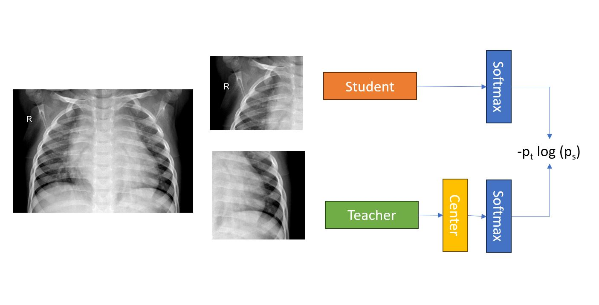

:new: *Please check out original dino model repo here [DINO](https://github.com/facebookresearch/dino)*

# Self-Supervised Vision Transformers with DINO for X-Ray Images

<div align="center">
  
</div>


## Kaggle notebook with training logs can be found [here](https://www.kaggle.com/code/ajaymin28/dinoxray-test-acc-95-5/)

## Training Dino backbone from scratch
```
python -m torch.distributed.launch --use_env --nproc_per_node=1 /kaggle/working/DinoXray/main_dino.py --data_path="../input/chest-xray-pneumonia/chest_xray" --output_dir="/kaggle/working/" --epochs=50 --patch_size=8 --num_workers=4 --batch_size_per_gpu=8
```

## Training backbone with pretrained dino
```
!wget -O /kaggle/working/DinoXray2/output/checkpoint.pth https://dl.fbaipublicfiles.com/dino/dino_deitsmall8_pretrain/dino_deitsmall8_pretrain_full_checkpoint.pth 
```
```
!python -m torch.distributed.launch --use_env --nproc_per_node=1 /kaggle/working/DinoXray2/main_dino.py --data_path="../input/chest-xray-pneumonia/chest_xray" --output_dir="/kaggle/working/DinoXray2/output/" --epochs=50 --patch_size=8 --num_workers=4 --batch_size_per_gpu=8
```

## Training Dino linear head
```
!mkdir /kaggle/working/DinoXray2/linearout
!python -m torch.distributed.launch --use-env --nproc_per_node=1 /kaggle/working/DinoXray2/eval_linear.py --data_path="../input/chest-xray-pneumonia/chest_xray" --pretrained_weights="/kaggle/working/DinoXray2/output/checkpoint.pth" --output_dir="/kaggle/working/DinoXray2/linearout" --linear_pretrained_weights="" --num_labels=2 --patch_size=8 --num_labels=2 --batch_size_per_gpu=16 --epochs=50 
```

### Multi-node training
We use Slurm and [submitit](https://github.com/facebookincubator/submitit) (`pip install submitit`). To train on 2 nodes with 8 GPUs each (total 16 GPUs):
```
python run_with_submitit.py --nodes 2 --ngpus 8 --arch vit_small --data_path /path/to/imagenet/train --output_dir /path/to/saving_dir
```

## Self-attention visualization
You can look at the self-attention of the [CLS] token on the different heads of the last layer by running:
```
python visualize_attention.py
```

<div align="center">
  
</div>

## License
This repository is released under the Apache 2.0 license as found in the [LICENSE](LICENSE) file.

## Citation
If you find this repository useful, please consider giving a star :star: and citation :t-rex::
```
@inproceedings{caron2021emerging,
  title={Emerging Properties in Self-Supervised Vision Transformers},
  author={Caron, Mathilde and Touvron, Hugo and Misra, Ishan and J\'egou, Herv\'e  and Mairal, Julien and Bojanowski, Piotr and Joulin, Armand},
  booktitle={Proceedings of the International Conference on Computer Vision (ICCV)},
  year={2021}
}
```
